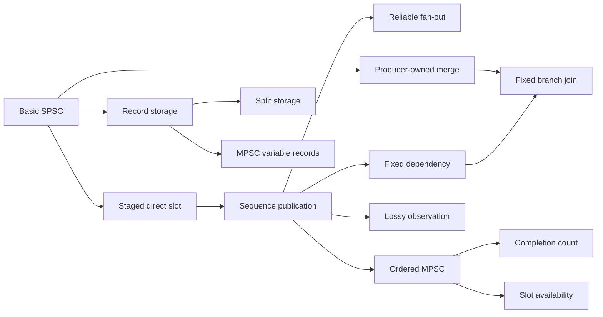

# Mechanism Catalog

These 24 independent assets are organized by contract, not by experiment number. Each row links
the exact note, implementation, a representative correctness test, relevant evidence, and any
`handoff-bench` route. `tests only` means no executable benchmark route exists. Experiment numbers
are historical identifiers, not reading order. See the [design space](../design-space.md) for
terminology and the [experiment index](../experiments/README.md) for research chronology.

## Reading paths

- **Publication and direct access:** basic -> staged -> sequence -> ordered MPSC -> completion
  count and slot availability. Compare call return with downstream visibility.
- **Completion holes and reuse:** ordered MPSC -> completion-count/slot MPSC -> ordered-release/
  slot-completion SPMC -> ordered worker stage. Identify who discovers each safe prefix.
- **Storage and lifetime:** fixed record -> variable byte record -> split descriptor/payload ->
  MPSC variable record. Compare slot credit, byte credit, and final release authority.
- **Broadcast and topology:** sequence -> reliable fan-out and pipeline -> lossy observation;
  producer-owned paths -> fixed branch join. Broadcast, work sharing, and path-local FIFO differ.

This diagram is a reading progression; an arrow is not necessarily a technical prerequisite.

## Point-to-point SPSC

These have one producer, one consumer, reliable delivery, and ordered observation. Capacity is
in slots unless the note says bytes.

| Asset and distinction | Source | Test | Evidence | Route |
| --- | --- | --- | --- | --- |
| [Basic bounded](basic-bounded-spsc.md), head/tail baseline | [header](../../include/handoff/spsc/basic_bounded_ring.hpp) | [bounded SPSC](../../tests/bounded_spsc_test.cpp) | [003](../experiments/003-cache-line-spsc-comparison.md) | `basic` |
| [Cache-line](cache-line-bounded-spsc.md), separated counters | [header](../../include/handoff/spsc/cache_line_bounded_ring.hpp) | [bounded SPSC](../../tests/bounded_spsc_test.cpp) | [003](../experiments/003-cache-line-spsc-comparison.md) | `cache-line` |
| [Cached-index](cached-index-bounded-spsc.md), local remote-index caches | [header](../../include/handoff/spsc/cached_index_bounded_ring.hpp) | [bounded SPSC](../../tests/bounded_spsc_test.cpp) | [004](../experiments/004-cached-index-spsc-comparison.md) | `cached-index` |
| [Batch](batch-bounded-spsc.md), all-or-nothing batch | [header](../../include/handoff/spsc/batch_bounded_ring.hpp) | [bounded SPSC](../../tests/bounded_spsc_test.cpp) | [005](../experiments/005-batch-spsc-comparison.md) | `batch` |
| [Bulk/burst](bulk-burst-bounded-spsc.md), fixed-count or partial progress | [header](../../include/handoff/spsc/bulk_burst_bounded_ring.hpp) | [bulk/burst](../../tests/bulk_burst_spsc_test.cpp) | [007](../experiments/007-staged-spsc-comparison.md) | `bulk`, `burst` |
| [Staged](staged-bounded-spsc.md), direct write before publication | [header](../../include/handoff/spsc/staged_bounded_ring.hpp) | [staged](../../tests/staged_spsc_test.cpp) | [007](../experiments/007-staged-spsc-comparison.md) | `staged` |
| [Bounded sequence](bounded-sequence-ring.md), sequence claim and publication | [header](../../include/handoff/sequence/bounded_sequence_ring.hpp) | [sequence](../../tests/sequence_ring_test.cpp) | [008](../experiments/008-sequence-publication-comparison.md) | `sequence` |

## Shared claims and work sharing

MPSC shared-ring claims have global claim-order FIFO. SPMC grants each position to one consumer.
Returned completion or release calls can precede visibility or reusable-slot discovery. The
producer-owned merge has only per-path FIFO and partitioned capacity.

| Asset and distinction | Source | Test | Evidence | Route |
| --- | --- | --- | --- | --- |
| [Ordered-publication MPSC](ordered-publication-mpsc.md), later publication waits at a hole | [header](../../include/handoff/mpsc/ordered_publication_ring.hpp) | [ordered MPSC](../../tests/ordered_mpsc_test.cpp) | [015](../experiments/015-mpsc-ordered-publication.md) | `mpsc-ordered` |
| [Completion-count MPSC](completion-count-mpsc.md), group completion may hide a ready prefix | [header](../../include/handoff/mpsc/completion_count_ring.hpp) | [completion MPSC](../../tests/completion_mpsc_test.cpp) | [016](../experiments/016-mpsc-producer-completion.md) | `mpsc-count` |
| [Slot-availability MPSC](slot-availability-mpsc.md), consumer finds ready generations | [header](../../include/handoff/mpsc/slot_availability_ring.hpp) | [slot MPSC](../../tests/completion_mpsc_test.cpp) | [016](../experiments/016-mpsc-producer-completion.md) | `mpsc-slot` |
| [Serialized-consumer SPMC](serialized-consumer-spmc.md), whole-operation consumer ownership | [header](../../include/handoff/spmc/serialized_consumer_ring.hpp) | [serialized SPMC](../../tests/serialized_spmc_test.cpp) | [017](../experiments/017-spmc-consumer-coordination.md) | `spmc-serialized` |
| [Ordered-release SPMC](ordered-release-spmc.md), shared claims and release cursor | [header](../../include/handoff/spmc/ordered_release_ring.hpp) | [ordered SPMC](../../tests/ordered_spmc_test.cpp) | [017](../experiments/017-spmc-consumer-coordination.md) | `spmc-ordered` |
| [Slot-completion SPMC](slot-completion-spmc.md), independent completion and producer discovery | [header](../../include/handoff/spmc/slot_completion_ring.hpp) | [slot SPMC](../../tests/slot_spmc_test.cpp) | [017](../experiments/017-spmc-consumer-coordination.md) | `spmc-slot` |
| [Two-path merge](two-path-merge.md), producer-owned SPSC paths and consumer selection | [header](../../include/handoff/topology/two_path_merge.hpp) | [merge](../../tests/two_path_merge_test.cpp) | [019](../experiments/019-two-path-merge.md) | tests only |

`mpsc-serialized` is a benchmark control using the basic SPSC ring under a producer mutex, not a
separate asset. Its comparison is [Experiment 015](../experiments/015-mpsc-ordered-publication.md).

## Broadcast, dependency, and overwrite

Reliable fan-out gates reuse on required readers; lossy rings permit detectable overwrite.
Worker-stage and join contracts have separate downstream and final reuse authorities.

| Asset and distinction | Source | Test | Evidence | Route |
| --- | --- | --- | --- | --- |
| [Sequence fan-out](bounded-sequence-fan-out.md), two required readers | [header](../../include/handoff/sequence/bounded_sequence_fan_out.hpp) | [fan-out](../../tests/sequence_fan_out_test.cpp) | [009](../experiments/009-sequence-fan-out-comparison.md) | `fan-out` |
| [Sequence pipeline](bounded-sequence-pipeline.md), fixed two-stage dependency | [header](../../include/handoff/sequence/bounded_sequence_pipeline.hpp) | [pipeline](../../tests/sequence_pipeline_test.cpp) | [010](../experiments/010-sequence-dependency-comparison.md) | `pipeline` |
| [Ordered worker stage](ordered-worker-stage.md), workers finish before downstream observation | [header](../../include/handoff/stage/ordered_worker_ring.hpp) | [worker stage](../../tests/ordered_worker_stage_test.cpp) | [018](../experiments/018-ordered-worker-stage.md) | tests only |
| [Two-branch join](two-branch-join.md), both branch writes precede join observation | [header](../../include/handoff/topology/two_branch_join.hpp) | [join](../../tests/two_branch_join_test.cpp) | [020](../experiments/020-two-branch-join.md) | tests only |
| [Sequence metadata](sequence-metadata-ring.md), lossy validated metadata observation | [header](../../include/handoff/metadata/sequence_metadata_ring.hpp) | [metadata](../../tests/sequence_metadata_ring_test.cpp) | semantic tests | tests only |
| [Sequence metadata/payload](sequence-payload-ring.md), lossy chunk-backed payload | [header](../../include/handoff/metadata/sequence_payload_ring.hpp) | [payload](../../tests/sequence_payload_ring_test.cpp) | [014](../experiments/014-sequence-payload-offered-load.md) | `sequence-payload` |

## Record storage and byte credit

Fixed inline records count slots; variable contiguous records count aligned bytes; split storage
has separate descriptor and byte capacities. The MPSC extension couples descriptor and byte
reservations across independent producer completion.

| Asset and distinction | Source | Test | Evidence | Route |
| --- | --- | --- | --- | --- |
| [Fixed-record SPSC](fixed-record-spsc.md), inline header and payload | [header](../../include/handoff/record/fixed_record_ring.hpp) | [fixed record](../../tests/fixed_record_ring_test.cpp) | semantic tests | `fixed-record` |
| [Variable-record SPSC](variable-record-spsc.md), circular byte storage | [header](../../include/handoff/record/variable_record_ring.hpp) | [variable record](../../tests/variable_record_ring_test.cpp) | semantic tests | `byte-record` |
| [Descriptor/payload SPSC](descriptor-payload-spsc.md), separate storage regions | [header](../../include/handoff/descriptor/descriptor_payload_ring.hpp) | [descriptor/payload](../../tests/descriptor_payload_ring_test.cpp) | semantic tests | `descriptor-record` |
| [MPSC variable record](mpsc-variable-record.md), paired descriptor and byte admission | [header](../../include/handoff/mpsc/variable_record_ring.hpp) | [MPSC variable record](../../tests/mpsc_variable_record_test.cpp) | [021](../experiments/021-mpsc-variable-record.md) | tests only |

Benchmark routes are exploratory plumbing unless [methodology](../benchmark-methodology.md) and
[reproducibility](../reproducibility.md) requirements are met. Mechanism notes own exact operations,
memory ordering, capacities, limits, and tests; [inspirations](../inspirations/README.md) own
external provenance.
